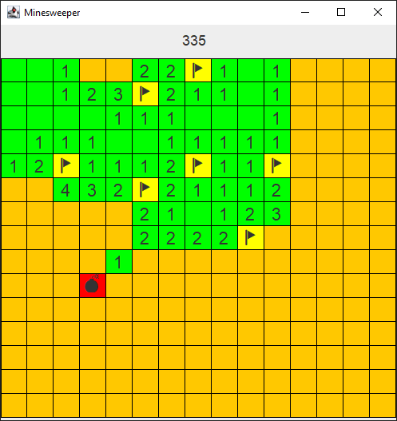
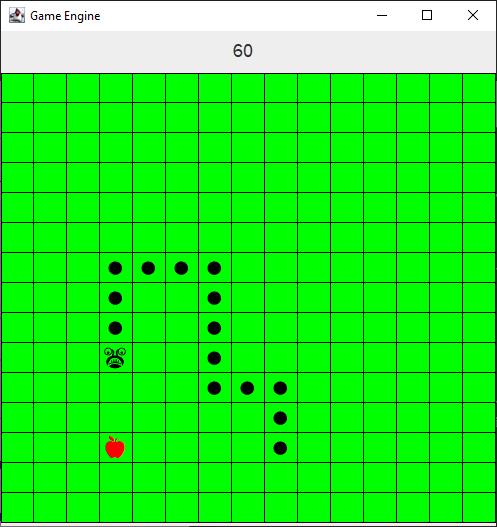
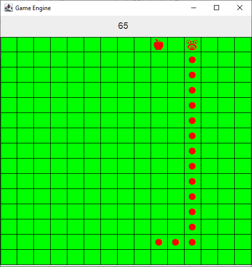

# Game Engine

The project presents an engine for creating simple games based on a grid and two games based on it: Minesweeper and Snake Game.

## Minesweeper
The first game available is Minesweeper. The game is known mainly from a package of free games delivered with Windows systems.

#### Object of the game

The object of the game is to reveal all fields that do not contain any bombs.

#### Game

The game is played by left-clicking on the fields in order to discover them. Each field has one of three possibilities:
- blank field - means that there is definitely no bomb near this field.
- a field with a number from 1 to 8 - determines how many bombs are near this field
- a field with a bomb - click on this field ends the game (game over)

The game allows you to mark the fields with a flag under which you can be sure that there is a bomb, because one field is marked with the number 1, for example, and around this field you have only one uncovered (then there is definitely a bomb). Such a marking can be made by right-clicking on the covered field. A field marked with a flag cannot be revealed with the left mouse button. On the other hand, the flag can be removed by pressing the right mouse button again on the field containing it.

Additionally, in the case when we have a number of flags near the field with a number corresponding to this number, we can click on them with the left and right mouse button at the same time to reveal all other fields nearby

#### Control
- LMB - unveiling the field
- RMB - field marking with a flag
- LMB + RMB - revealing the remaining fields, when the number of nearby flags matches the number from the field.

#### Win
When all boxes without a bomb are revealed, the game is won. At this point, all remaining unflagged fields are flagged.

#### Screenshots

## Snake game

The second game available is the snake game. The game was quite popular on old phones back in a time when there weren't any smartphones yet.

#### Object of the game

The goal of the game is to eat as many fruits as possible and thus score as many points as possible.

#### Game

The game is about steering the snake around the board so that it eats as many fruits as possible. With each piece of fruit eaten, the snake grows and the speed of the game increases.
Additionally, the snake cannot get into the wall or into itself, as this will result in a loss.

#### Control
- WASD / Keyboard arrows - control the direction of the snake's movement
- Space - restart the game after losing or winning

#### Win
You win after eating 25 fruits

#### Screenshots

